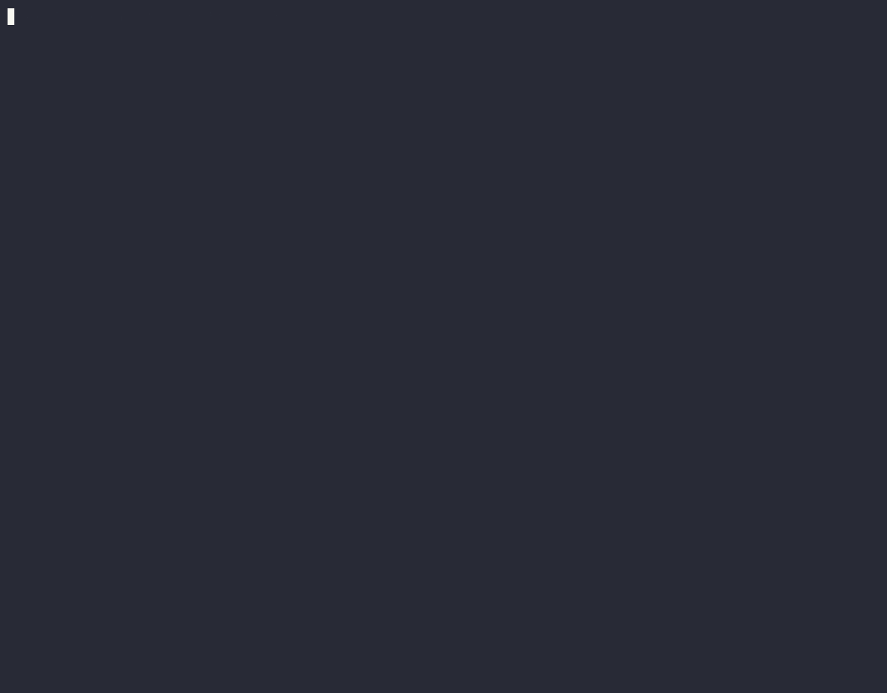

# Nexus Shield Harness



Open-source benchmark harness for evaluating **AI agent runtime security** against MCP tool chains, prompt injection, intent divergence, and multi-step trajectory attacks.

**Quick demo:** `pip install rich && python scripts/demo_terminal_sim.py`

**Record hero GIF:** `bash scripts/render_gif.sh` (requires [VHS](https://github.com/charmbracelet/vhs) + ffmpeg)

This repository contains **only** the public scenario runner, scoring utilities, and HTTP adapters. It does **not** include proprietary Nexus Shield SaaS dashboard code, private API routes, database schemas, or production backend logic.

> **Enterprise runtime protection:** Need sub-10ms edge enforcement, HITL governance, audit evidence, and the full Proof Center dashboard? Visit **[https://nexusshield.ai](https://nexusshield.ai)**.

## Quick start

```bash
git clone https://github.com/nexusshield/harness.git
cd harness
cp .env.example .env
npm install
npm run harness
```

Offline heuristic evaluation (no live agent required):

```bash
npm run harness
# or
npm run harness -- --json-out results/local-run.json
```

Evaluate against a local agent gateway or MCP runtime:

```bash
export HARNESS_BASE_URL=http://127.0.0.1:8080
export HARNESS_API_KEY=your_local_eval_token_here
npm run harness:http
```

Python HTTP latency + attack benchmark (stdlib-only):

```bash
python python/run_benchmark.py --base-url http://127.0.0.1:8080 --json-out results/http-benchmark.json
```

### Reproducible MCP-SEC-SCORE Benchmark

Reproduce Proof Center metrics locally (no Nexus Shield account required):

```bash
# Docker (recommended)
docker run --rm ghcr.io/baturhantasdelen-sudo/harness:latest --eval-mcp

# or from source
python scripts/run_reproducible_benchmark.py --eval-mcp
```

### 2026 Shadow AI Agent Scorecard

Enterprise scorecard for top-10 agent frameworks vs. indirect injection, tool abuse, and delegation risks:

```bash
docker run --rm ghcr.io/baturhantasdelen-sudo/harness:latest --eval-scorecard

# or from source
python scripts/run_reproducible_benchmark.py --eval-scorecard
python scripts/eval_scorecard.py --output results/scorecard_2026.json
```

Evidence bundle chain per evaluation: **Agent Identity → Requested Intent → Tool Call → Before State Hash → After State Hash → Cryptographic Evidence Bundle**.

**OWASP alignment:** Leaderboard JSON (`results/mcp_leaderboard.json`) includes `owasp_genai_top_10` and `owasp_agentic` tags per scenario (see [SECURITY.md](./SECURITY.md)). **On-device privacy:** harness runs locally with `external_cloud_proxy: false` metadata for air-gapped reproducibility.

Test MCP servers against indirect prompt injection, cross-tool exfiltration, and privilege escalation:

```bash
# Optional: start isolated sandbox (Postgres, filesystem, exfil sink)
docker compose -f docker/mcp-sandbox/docker-compose.yml up -d

python -m runners.mcp_runner --scenarios scenarios/mcp_hijack/ --output results/mcp_leaderboard.json
```

Community listings: [corca-ai/awesome-llm-security](https://github.com/corca-ai/awesome-llm-security) · [mcpservers.org/submit](https://mcpservers.org/submit)

See [scenarios/mcp_hijack/README.md](./scenarios/mcp_hijack/README.md) for scenario details and scoring.

Generate MCP-Sec Verified badges for adapter READMEs:

```bash
python -m runners.badge_generator --input results/mcp_leaderboard.json
```

Record the terminal demo as a GIF: [docs/DEMO_GIF_GUIDE.md](./docs/DEMO_GIF_GUIDE.md)

## What this harness measures

| Metric | Description |
|---|---|
| **Block rate** | % of attack scenarios blocked (`BLOCK`, `REJECTED`, `REQUIRE_APPROVAL`) |
| **Latency p50 / p95** | Per-scenario evaluation time (ms) |
| **Evidence hash** | SHA-256 digest per scenario outcome for reproducibility |
| **Baseline delta** | Comparison vs official Nexus Shield Proof Center baseline |

## Proof Center baseline mapping

Official public Proof Center baseline (marketing + live benchmark methodology):

| Baseline | Value |
|---|---|
| Agents tested | 127 |
| Tool calls analyzed | 48,291 |
| Block rate | **99.3%** |

After each run, the CLI prints:

- Your block rate vs **99.3%**
- Whether you **meet baseline**
- Latency percentiles

Example output:

```text
--- Proof Center Baseline ---
Official block rate: 99.3% (127 agents, 48,291 tool calls)
Your block rate:     100% (+0.7 vs baseline)
Meets baseline:      YES
```

## Scenario corpus

Starter scenarios live in `scenarios/index.json` (17 core vectors across prompt injection, jailbreak, MCP poisoning, intent divergence, trajectory violations, and destructive actions). The corpus is designed to expand toward the full 500+ MCP attack matrix referenced in Nexus Shield Proof Center methodology.

Categories include:

- `PROMPT_INJECTION`, `JAILBREAK`, `INDIRECT_INJECTION`
- `TOOL_MISUSE`, `TOOL_ABUSE`, `PRIVILEGE_ESCALATION`
- `MCP_POISONING`, `INTENT_MISMATCH`, `TRAJECTORY_VIOLATION`
- `DESTRUCTIVE_ACTION`, `DATA_EXFILTRATION`, `SYSTEM_PROMPT_LEAKAGE`

## Adapters

| Adapter | Flag | Use case |
|---|---|---|
| `local-heuristic` | `--adapter local` (default) | Offline regex/heuristic scoring — no network |
| `http-agent-action` | `--adapter http` | POST to `HARNESS_BASE_URL/v1/agent/action` |

Implement a custom adapter by satisfying the `GuardAdapter` interface in `src/types.ts`.

## Repository boundary (OSS vs proprietary)

| In this repo (public) | Stays private (Nexus Shield platform) |
|---|---|
| Scenario definitions & runner | Dashboard UI & SaaS billing |
| Scoring & evidence hashing | Production action-firewall engine |
| HTTP benchmark CLI | Supabase schemas & user auth |
| Local heuristic evaluator | Private API routes & disclosure pipeline |

## Environment variables

See `.env.example`. **Never commit real secrets.**

| Variable | Purpose |
|---|---|
| `HARNESS_BASE_URL` | Agent runtime base URL (default `http://127.0.0.1:8080`) |
| `HARNESS_API_KEY` | Optional bearer token for local gateway |
| `HARNESS_AGENT_ID` | Synthetic agent ID header for scenario runs |

## Development

```bash
npm run build
npm test
npm run harness -- --limit 5
```

## License

Apache License 2.0 — see [LICENSE](./LICENSE).

## Contributing

Pull requests welcome for new scenarios, adapters, and reproducibility fixtures. Please do not include proprietary endpoints, credentials, or internal Nexus Shield platform code.

---

**Need production-grade runtime enforcement?** → [https://nexusshield.ai](https://nexusshield.ai)
